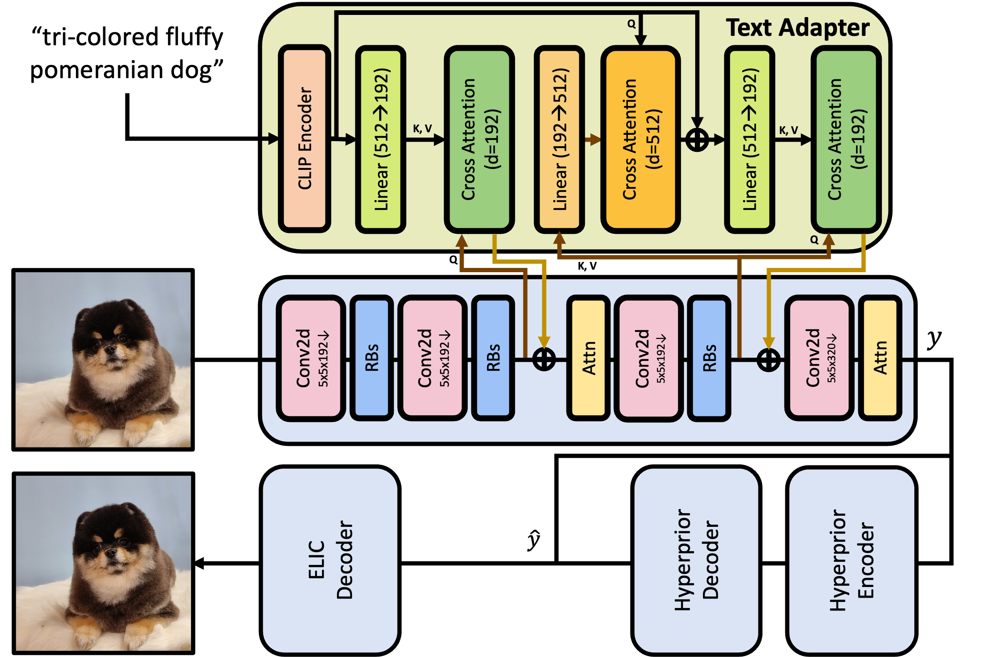

## Example Content
This paper propose a compression framework that leverages text information mainly by text-adaptive encoding and training with joint image-text loss. By doing so, they avoid decoding based on text-guided generative models---known for high generative diversity---and effectively utilize the semantic information of text at a global level. 

